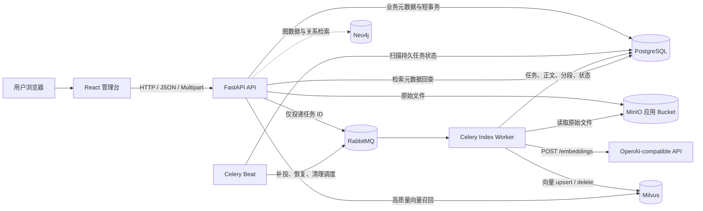
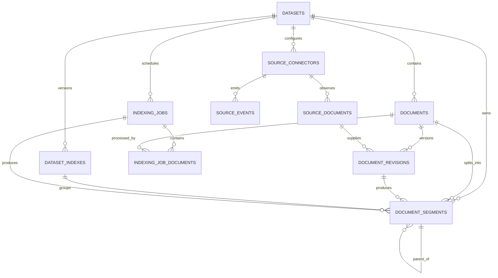
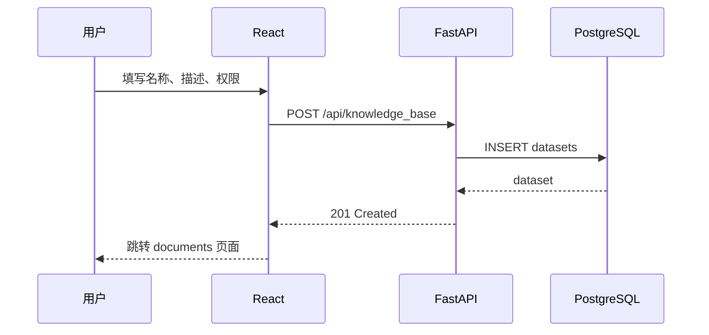
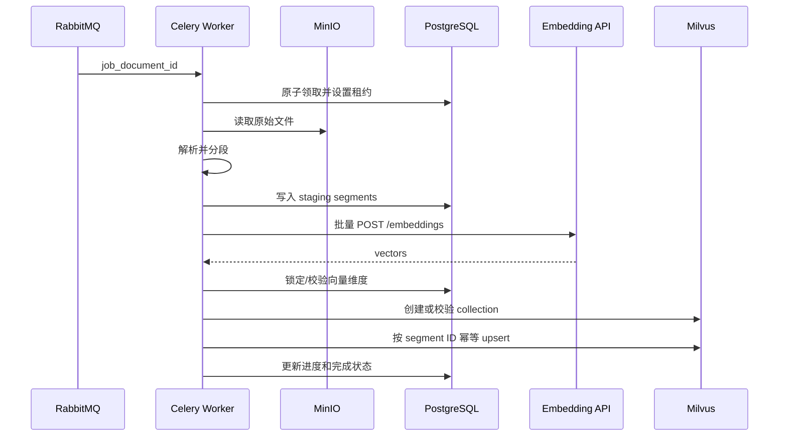
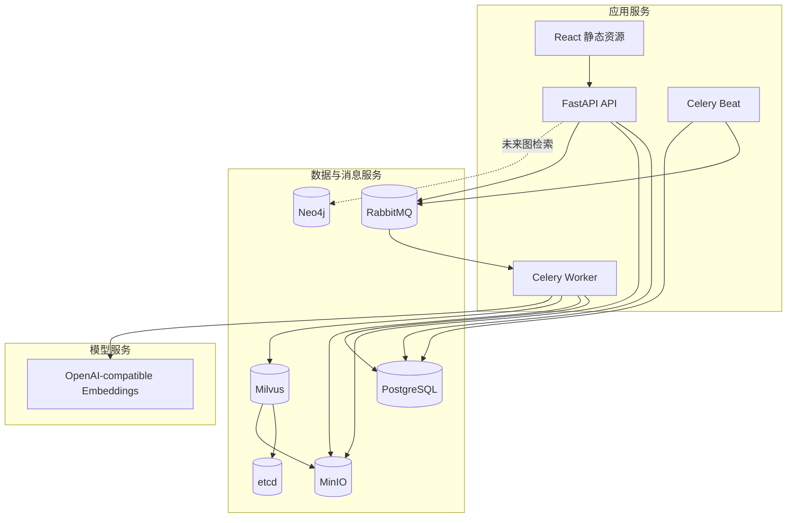

# Graph-RAG 项目架构设计

最后更新：2026-08-31

文档状态：目标架构已确认，正在按实施路线分阶段建设

## 1. 文档目的

本文档是 Graph-RAG 项目的项目级架构入口，用于说明：

- 系统由哪些组件组成。
- 每个组件负责什么、不负责什么。
- 业务数据、原始文件、任务状态和向量分别存在哪里。
- 知识库如何创建、上传、解析、分段和建立索引。
- PostgreSQL、MinIO、RabbitMQ、Celery、OpenAI-compatible API、Milvus 和 Neo4j 如何协作。
- 当前代码已经实现到什么程度，目标架构还有哪些部分尚待建设。
- 扩展系统时必须保持哪些架构约束。

功能级详细设计见：

- [Dify 风格知识库创建与完整索引设计](superpowers/specs/2026-08-31-dify-style-dataset-indexing-design.md)
- [通用数据源变更检测与安全增量索引设计](superpowers/specs/2026-08-31-source-change-sync-design.md)
- [完整索引实施路线图](superpowers/plans/2026-08-31-dataset-indexing-roadmap.md)

## 2. 架构状态说明

项目处于从知识库管理原型向完整异步索引系统演进的阶段。本文使用以下状态：

- **已实现**：当前代码中已经存在并可使用的能力。
- **基础已存在**：已有模型、配置或适配器，但完整业务链路尚未打通。
- **目标架构**：设计已经确认，将按实施路线建设，当前不能当作已上线能力。
- **预留**：仅存在模块文件或基础设施，尚未形成可用业务能力。

### 2.1 当前与目标能力对照

| 能力 | 当前状态 | 目标状态 |
|---|---|---|
| 知识库元数据 | 已通过 PostgreSQL `datasets` 读写 | 保持 PostgreSQL 为唯一事实来源 |
| 文档元数据 | ORM 已映射 `documents` | 上传文件时创建文档记录并维护索引状态 |
| 分段元数据 | ORM 已映射 `document_segments` | 保存普通/父子分段、关键词、源定位和索引版本 |
| 原始文件 | 当前上传接口写本地 `data/uploads` | 写入 MinIO 应用专用 bucket |
| 知识库创建页面 | 当前把知识库、上传、检索和 Milvus 配置放在同一弹窗 | 先创建空知识库，再进入上传和处理页面 |
| 文档解析 | 尚未形成 parser 层 | 支持 TXT、MD、PDF、DOCX、XLS、XLSX、CSV |
| 数据源同步 | 尚未形成 connector、监听和对账链路 | 稳定源 ID + Hash，监听低延迟，轮询/完整对账兜底 |
| 文档更新 | 当前上传按单次文件处理 | 不可变 revision，先构建后切换，再异步清理旧向量 |
| 分段预览 | 尚未实现 | 使用与正式索引相同的 parser/splitter 做真实预览 |
| Embedding | 尚未实现完整客户端 | 调用后端预配置的 OpenAI-compatible Embeddings API |
| 向量存储 | Milvus adapter 可创建/删除简单 collection | 后端按索引版本创建 schema、HNSW 索引并幂等 upsert |
| 异步任务 | 尚未接入 RabbitMQ/Celery | RabbitMQ broker + Celery Worker/Beat + PostgreSQL 持久状态 |
| 索引版本 | 尚未实现 | `dataset_indexes` 双版本构建和原子激活 |
| 经济索引 | 尚未实现 | PostgreSQL 关键词数组和 GIN 索引，不调用 Embedding/Milvus |
| Neo4j Graph-RAG | Compose 和导入脚本已存在，Python 模块目前是占位 | 在索引与检索基础稳定后接入图数据准备和图检索 |

## 3. 总体架构



系统按职责分为五层：

1. **交互层**：React 管理知识库、文档、分段配置和任务进度。
2. **API 与应用层**：FastAPI 执行身份校验、参数校验、短事务和任务创建。
3. **异步处理层**：RabbitMQ、Celery Worker 和 Celery Beat 负责长时间索引任务。
4. **数据与对象层**：PostgreSQL 保存业务事实，MinIO 保存原始文件，Milvus 保存向量，Neo4j 保存图关系。
5. **模型与检索层**：OpenAI-compatible API 生成 Embedding；后续检索层组合向量、关键词和图关系结果。

## 4. 核心架构原则

### 4.1 PostgreSQL 是业务事实来源

PostgreSQL 保存：

- 知识库。
- 文档。
- 分段正文。
- 父子分段关系。
- 关键词。
- 文件对象元数据。
- 处理规则和检索配置。
- 索引版本。
- 索引任务、文档级进度、错误和重试信息。

前端查询的任务状态来自 PostgreSQL，不来自 Celery result backend。

### 4.2 MinIO 只保存原始文件和文件类对象

应用使用独立 bucket，默认名称为 `graph-rag-uploads`。应用对象不与 Milvus 内部使用的 MinIO bucket 混用。

PostgreSQL 的 `documents.data_source_info` 只保存 bucket、object key、文件名、MIME、大小和 SHA-256 等引用信息，不保存 MinIO 密钥。

### 4.3 Milvus 只保存高质量索引向量

Milvus entity 的主键等于 `document_segments.id`。Milvus 不保存完整正文，命中向量 ID 后必须回查 PostgreSQL，以确认分段仍处于有效状态并取得正文、父块和源定位。

虽然 PostgreSQL 使用 pgvector 镜像，且现有 `document_segments` 表包含 `vector` 列，本期目标架构不把向量重复写入 PostgreSQL；该列保持 `NULL`。

### 4.4 RabbitMQ 负责消息投递，不负责业务状态

Celery 使用 RabbitMQ 作为 broker，不使用 Redis。RabbitMQ 中的消息只携带 `job_id`、`job_document_id` 等标识符，不携带文件、正文、密钥、完整配置或向量。

RabbitMQ/Celery 是至少一次投递语义，重复消息属于正常故障恢复路径，业务任务必须幂等。

### 4.5 API 只做短事务，Worker 执行长任务

FastAPI 不在上传或创建任务请求中同步完成 PDF/Office 解析、Embedding 或 Milvus 批量写入。API 在 PostgreSQL 创建持久任务后投递 RabbitMQ，并返回 `202 Accepted`。

分段预览是例外：它同步返回有限数量的真实块，但有独立的文件大小、执行时间和结果数量限制，而且同步 parser 会在线程池中运行，不阻塞 FastAPI event loop。

## 5. 组件职责

| 组件 | 主要职责 | 明确不负责 |
|---|---|---|
| React | 知识库列表、创建、上传、索引配置、预览和进度展示 | 不持有基础设施密钥；不决定向量维度或 collection 名称 |
| FastAPI | API 契约、参数/权限校验、短事务、任务创建和状态查询 | 不在请求线程完成完整索引 |
| Connector Service | 将监听、轮询和完整对账归一为幂等 UPSERT/DELETE 事件 | 不直接写分段或绕过持久事件调用 Worker |
| PostgreSQL | 元数据、正文、规则、任务、状态、索引版本 | 本期不保存实际 Embedding 向量 |
| MinIO | 原始文件持久化 | 不保存业务状态；不替代 PostgreSQL |
| RabbitMQ | 持久化 Celery 消息投递 | 不作为任务查询数据库 |
| Celery Worker | 下载、解析、分段、Embedding、关键词、Milvus 写入 | 不直接服务前端 HTTP 请求 |
| Celery Beat | pending 补投、过期租约恢复、延迟清理 | 不执行用户请求中的同步工作 |
| OpenAI-compatible API | 根据模型目录生成 Embedding | 不保存知识库业务元数据 |
| Milvus | 高质量向量索引、相似度召回 | 不保存完整正文和任务状态 |
| Neo4j | 图实体、关系和后续 Graph-RAG 路径检索 | 当前不参与已实现的知识库 CRUD |

## 6. 数据架构

### 6.1 领域关系



其中 `datasets`、`documents`、`document_segments` 已存在；`dataset_indexes`、`indexing_jobs`、`indexing_job_documents` 以及数据源同步相关表属于已经批准的目标架构。

### 6.2 `datasets`

知识库主表。重要职责：

- `id`、`name`、`description`：知识库身份和展示信息。
- `permission`：访问范围。
- `indexing_technique`：当前选择的高质量或经济索引方式。
- `embedding_model`、`embedding_model_provider`：当前选择的模型标识。
- `retrieval_model_config`：当前检索配置。
- `partial_user_config`：当前处理规则和用户配置。
- `deleted_at`：软删除标记。

知识库 ORM 的表名固定为 `datasets`，不使用 `knowledge_bases` 表。

### 6.3 `documents`

保存一个知识库中的源文档：

- `dataset_id`：所属知识库。
- `data_source_info`：MinIO 对象引用和文件摘要。
- `name`：用户看到的原始文件名。
- `indexing_status`：当前处理阶段。
- `error`：最近一次安全错误信息。
- `enabled`、`archived`、`deleted_at`：可用性和生命周期。

目标文档状态流：

```text
waiting
  → downloading
  → parsing
  → splitting
  → embedding（仅高质量）
  → indexing
  → completed
```

不可恢复错误进入 `error`。

### 6.4 `document_segments`

保存真实正文分段：

- `content`：分段正文。
- `position`：文档内顺序。
- `index_type`：普通块、父块或子块。
- `parent_id`：子块关联父块。
- `keywords`：经济索引关键词。
- `embedding_status`：向量生成状态。
- `dataset_index_id`：目标架构中的索引版本。
- `indexing_job_id`：生成该分段的任务。
- `source_metadata`：PDF 页码、标题路径、sheet 和行号等定位信息。
- `content_hash`：幂等与重复检查。

### 6.5 `dataset_indexes`

目标架构中的索引版本表，用于解决 PostgreSQL 与 Milvus 无法加入同一事务的问题。

索引状态：

```text
building → active → retired → deleting
    └────→ failed
```

一个知识库最多有一个 active 版本。高质量版本记录模型、维度、距离度量和 Milvus collection；经济版本不关联 collection。

### 6.6 `indexing_jobs`

保存一次索引业务任务的不可变配置快照、总体进度、租约、重试和错误。

任务类型：

- `initial_index`
- `add_documents`
- `reindex_documents`
- `reindex_dataset`

任务状态：

```text
pending → queued → running → completed
                      ├────→ partial_success
                      ├────→ retry_wait
                      ├────→ failed
                      └────→ cancelled
```

### 6.7 `indexing_job_documents`

保存任务中每个文档的独立进度、阶段、warnings、错误、attempt、心跳和租约。它使批量任务可以部分成功，也使失败文档可以单独重试。

### 6.8 数据源同步与文档版本

通用数据源同步增加以下目标实体：

- `source_connectors`：连接器类型、secret 引用、监听/轮询模式、游标和对账状态。
- `source_documents`：稳定源标识、源版本、Hash 和缺失确认状态。
- `source_events`：标准化 UPSERT/DELETE 事件、幂等键、投递和处理状态。
- `document_revisions`：不可变原始内容版本、三类 Hash、MinIO object key 和生命周期。
- transactional outbox：与源事件同事务落库，提交后可靠投递 RabbitMQ。

`documents` 维护 `active_revision_id` 和 `desired_revision_id`；前者决定当前检索版本，后者阻止乱序任务把旧 revision 重新激活。`document_segments` 通过 `document_revision_id` 关联产生它的原始内容版本。

详细字段、约束和状态机见[通用数据源变更检测与安全增量索引设计](superpowers/specs/2026-08-31-source-change-sync-design.md)。

## 7. 数据归属与一致性

| 数据 | 唯一事实来源 | 可重建副本 |
|---|---|---|
| 知识库和权限 | PostgreSQL | 无 |
| 文档对象引用和摘要 | PostgreSQL | 可由 MinIO 对象核对 |
| 数据源游标、源事件和生效 revision | PostgreSQL | 可由数据源重新对账 |
| 原始文件 | MinIO | 可由用户重新上传 |
| 分段正文和父子关系 | PostgreSQL | 可从原始文件和规则重新生成 |
| 索引任务状态 | PostgreSQL | RabbitMQ/Celery 不是事实来源 |
| Embedding 向量 | Milvus | 可从 PostgreSQL 正文和模型重新生成 |
| 经济关键词 | PostgreSQL | 可从分段正文重新生成 |
| 图实体和关系 | Neo4j | 未来可从有效分段重新抽取 |

跨 PostgreSQL、MinIO 和 Milvus 的操作采用幂等、版本和补偿，而不是假设存在分布式事务。

## 8. 核心业务流程

### 8.1 创建空知识库



创建空知识库时不上传文件、不调用 Embedding、不创建 Milvus collection，也不向前端暴露 Milvus 参数。

### 8.2 上传文档

```text
浏览器选择文件
  → FastAPI 校验扩展名、MIME、magic、大小和压缩包安全
  → 流式计算 SHA-256
  → 写入 MinIO graph-rag-uploads
  → 创建 documents 记录
  → indexing_status = waiting
```

支持：

- TXT：`.txt`
- Markdown：`.md`
- PDF：`.pdf`，仅文本层，本期不做 OCR
- Word：`.docx`
- Excel：`.xls`、`.xlsx`
- CSV：`.csv`

批量上传允许部分成功，一个坏文件不会回滚其他已经成功的文件。

### 8.3 真实分段预览

```text
文档 ID + 分段配置
  → PostgreSQL 查询 MinIO object key
  → MinIO 读取原始文件
  → ParserRegistry 生成 ParsedDocument
  → Segmenter 生成普通块或父子树
  → 截断为有限预览结果返回
```

预览不持久化 `document_segments`，不调用 Embedding，不写 Milvus。

### 8.4 创建索引任务

API 在一个 PostgreSQL 事务内：

1. 校验知识库、文档、模型和分段配置。
2. 判断初次索引、追加文档、部分重建或全量重建。
3. 保存不可变处理规则和检索配置快照。
4. 创建索引版本、任务和文档任务记录。
5. 提交事务。
6. 向 RabbitMQ 投递只包含 ID 的 Celery 消息。

如果 RabbitMQ 暂时不可用，任务保持 pending，由 Celery Beat 后续补投。

### 8.5 高质量完整索引



首次真实 Embedding 响应决定向量维度。后续批次或文档返回不同维度时任务失败，不能混入同一索引版本。

### 8.6 经济索引

经济模式执行解析和普通分段，然后提取中英文关键词并写入 `document_segments.keywords`。它：

- 不调用 OpenAI-compatible API。
- 不创建 Milvus collection。
- 不写 Milvus。
- 不支持父子分段。

### 8.7 父子分段

```text
父块：较完整上下文，保存 PostgreSQL，不生成向量
  └── 子块：较短语义单元，保存 PostgreSQL并生成向量
```

向量检索命中子块后，通过 `parent_id` 回查 PostgreSQL，并将父块作为最终上下文。这样兼顾短块匹配精度和长上下文完整性。

Excel/CSV 中，sheet 或连续行组可以作为父块，行或小行组作为子块；每个子块都携带表头，避免脱离父块后失去列含义。

### 8.8 安全重建和索引切换

全量重建不能先删除旧索引：

```text
旧版本 active
  → 新版本 building
  → 新 collection + 新 staging segments
  → 全部文档和向量校验成功
  → PostgreSQL 短事务切换
       旧版本 active  → retired
       新版本 building → active
  → 延迟清理旧 collection
```

任一目标文档最终失败时，新版本不得激活，旧版本继续可检索。

### 8.9 删除和补偿

删除 API 先软删除 PostgreSQL 记录并返回，再由 maintenance queue：

- 删除 Milvus 中的文档向量。
- 删除知识库的 active、retired、failed 和 building collection。
- 删除 MinIO 原始对象。
- 清理中断任务产生的 staging segments。

所有清理操作幂等；目标已不存在视为成功。

### 8.10 数据源变更同步

数据源使用稳定的 `connector_id + source_document_key` 标识逻辑文档，并计算原始内容、规范化正文和索引配置 Hash。Webhook/CDC/事件订阅负责低延迟发现，增量轮询和周期性完整对账补偿漏事件，所有变化统一持久化为幂等 UPSERT/DELETE。

文档更新禁止先删除旧向量：

```text
发现 UPSERT
  → 新建不可变 document revision
  → 保持旧 revision active
  → 解析、分段、Embedding/Milvus staging 写入
  → 校验新分段、向量数量和维度
  → PostgreSQL 短事务切换 active revision
  → maintenance queue 异步清理旧向量和旧对象
```

确认删除后先在 PostgreSQL 撤销可见性，再异步清理外部资源。普通轮询的一次缺失不能直接判定删除；只有权威删除事件或成功完整快照的连续缺失/宽限期到期才能确认。

## 9. RabbitMQ 与 Celery 可靠性

### 9.1 至少一次投递

Celery 使用晚确认。Worker 在执行中退出时，RabbitMQ 可以重新投递消息，因此不能用“消息只会收到一次”作为正确性前提。

### 9.2 幂等键

- job 业务键：`job_id`
- 文档任务唯一约束：`(job_id, document_id)`
- segment ID：由索引版本、文档、父块、position 和 content hash 生成稳定 UUIDv5
- Milvus：按 segment ID upsert
- 源事件：provider event ID，或 connector、source key、source version 和 operation 的 Hash
- revision 索引任务：source event ID 或客户端请求幂等键

Connector 使用 transactional outbox，确保 PostgreSQL 已提交的源事件最终可以投递 RabbitMQ。重复 outbox 投递属于正常情况。

### 9.3 心跳和租约

Worker 领取文档任务时写入 worker ID、heartbeat 和 lease expiration。有效租约阻止第二个 Worker 同时处理；租约过期后恢复任务可以重新领取。

文档 revision 激活前还必须验证目标 revision 等于 `documents.desired_revision_id`；不相等的旧任务进入 `superseded`，不得覆盖更新版本。

### 9.4 重试分类

可自动重试：

- MinIO、Milvus、PostgreSQL 或 RabbitMQ 的短暂连接故障。
- OpenAI-compatible API 的 429、502、503、504 和超时。

不可自动重试：

- 文件损坏或格式不支持。
- PDF 无可提取文本。
- Embedding API 401/403。
- 模型不存在或返回维度不一致。
- 业务配置非法。

### 9.5 取消

pending/queued 任务直接取消；running 任务设置取消请求。Worker 在文档边界、解析后、分段批次、Embedding 批次和 Milvus 批次之间协作检查，不依赖强杀进程作为正常取消机制。

## 10. 模型与向量架构

### 10.1 后端模型目录

Embedding 模型由后端配置：

```text
EMBEDDING__PROVIDER=openai_compatible
EMBEDDING__BASE_URL=...
EMBEDDING__API_KEY=...
EMBEDDING__DEFAULT_MODEL=...
EMBEDDING__MODELS=[...]
```

前端只获得启用模型的 ID、显示名称、provider 和默认标记。API Key 和 base URL 不返回前端。

### 10.2 Milvus collection

每个高质量索引版本对应一个 collection：

```text
graph_rag_{dataset_id}_{index_id}
```

核心字段：

| 字段 | 类型 | 说明 |
|---|---|---|
| `id` | VARCHAR | segment ID，主键 |
| `embedding` | FLOAT_VECTOR | 向量 |
| `dataset_id` | VARCHAR | 知识库过滤 |
| `document_id` | VARCHAR | 文档过滤和清理 |
| `dataset_index_id` | VARCHAR | 版本校验 |
| `parent_id` | nullable VARCHAR | 父子定位 |
| `position` | INT64 | 分段顺序 |

默认距离为 COSINE，索引类型为 HNSW。连接、collection、维度和索引参数由后端管理，不显示在知识库创建页面。

## 11. Graph-RAG 与 Neo4j 边界

当前 `docker-compose.yml` 已包含 Neo4j 和 CSV/Cypher 初始化脚本，但以下 Python 文件目前只有模块占位说明：

- `graph_data_preparation.py`
- `graph_rag_retrieval.py`
- `hybrid_retrieval.py`
- `intelligent_query_router.py`
- `generation_integration.py`
- `milvus_index_construction.py`

因此当前不能把图抽取、图检索、混合检索或生成编排描述为已完成能力。

后续合理边界是：

```text
有效 document_segments
  → 图实体/关系抽取
  → Neo4j 图数据
  → 查询路由
      ├── Milvus 向量召回
      ├── PostgreSQL 关键词召回
      └── Neo4j 图路径召回
  → 合并、去重、重排
  → 生成模型
```

图数据必须能追溯到 `dataset_id`、`document_id`、`segment_id` 和 `dataset_index_id`，以便索引重建或删除时同步失效。

## 12. API 边界

目标核心 API：

```text
POST   /api/knowledge_base
GET    /api/knowledge_base/list
GET    /api/knowledge_base/{dataset_id}
DELETE /api/knowledge_base/{dataset_id}

GET    /api/indexing/options

POST   /api/knowledge_base/{dataset_id}/documents
GET    /api/knowledge_base/{dataset_id}/documents
DELETE /api/knowledge_base/{dataset_id}/documents/{document_id}

POST   /api/knowledge_base/{dataset_id}/indexing/preview
POST   /api/knowledge_base/{dataset_id}/indexing/jobs
GET    /api/knowledge_base/{dataset_id}/indexing/jobs
GET    /api/knowledge_base/{dataset_id}/indexing/jobs/{job_id}
POST   /api/knowledge_base/{dataset_id}/indexing/jobs/{job_id}/retry
POST   /api/knowledge_base/{dataset_id}/indexing/jobs/{job_id}/cancel
```

通用数据源扩展 API 包括 connector CRUD、手工 sync/reconcile、事件查询、文档 revision 查询/重试和签名 Webhook。完整契约见[数据源同步设计](superpowers/specs/2026-08-31-source-change-sync-design.md#14-api-边界)。

统一错误响应包含稳定错误码、用户消息、脱敏 detail 和 request ID。基础设施密码、完整正文、完整向量和服务端调用栈不进入响应。

## 13. 配置架构

### 13.1 配置来源优先级

项目使用 Pydantic Settings 和 OmegaConf，配置来源为：

```text
构造参数
  > 操作系统环境变量
  > 开发环境 .env
  > config_{APP_ENV}.yaml
  > 文件 secret
  > 模型默认值
```

### 13.2 顶层配置字段

`Settings` 中的顶层字段决定环境变量的第一段名称。例如：

```python
class Settings(BaseSettings):
    database: DatabaseSettings
    vector_store: VectorStoreSettings
```

配合 `env_nested_delimiter="__"`，映射为：

```text
DATABASE__HOST
DATABASE__PORT
DATABASE__DATABASE
DATABASE__USERNAME
DATABASE__PASSWORD

VECTOR_STORE__HOST
VECTOR_STORE__PORT
```

目标架构增加：

```text
EMBEDDING__...
OBJECT_STORAGE__...
BROKER__...
UPLOAD__...
PARSER__...
PREVIEW__...
INDEXING__...
```

配置对象中的顶层字段名就是 `database`、`vector_store` 等名称的来源，不是数据库自动生成的名称。

### 13.3 敏感信息

以下配置只允许存在于服务端环境或 secret 管理系统：

- PostgreSQL 密码。
- RabbitMQ 用户和密码。
- MinIO access key 和 secret key。
- OpenAI-compatible API Key。
- Milvus token、用户和密码。
- 应用 secret key。

不得把真实 `.env` 提交到 Git。

## 14. 部署拓扑



推荐启动顺序：

1. PostgreSQL。
2. MinIO、etcd、Milvus。
3. RabbitMQ。
4. Neo4j（需要图功能时）。
5. 数据库迁移。
6. FastAPI。
7. Celery Worker。
8. Celery Beat。
9. React 开发服务器或静态构建。

API 和 Worker 不共享本地上传目录；它们只通过 PostgreSQL、MinIO 和 RabbitMQ 协作，因此可以独立扩容。

## 15. 代码模块边界

### 15.1 当前目录

```text
main.py                         FastAPI 应用装配
frontend/src/App.jsx            当前 React 单页入口
rag_modules/api/                API 路由和 DTO
rag_modules/config/             Pydantic Settings 与 YAML
rag_modules/db/                 SQLAlchemy Base、session 和 ORM
rag_modules/repositories/       PostgreSQL 数据访问
rag_modules/services/           应用服务
rag_modules/vector_stores/      向量存储协议和 Milvus adapter
rag_modules/mysql/              旧数据库封装代码
cypher/                         Neo4j CSV 和初始化脚本
tests/                          当前后端契约测试
```

### 15.2 目标新增边界

```text
rag_modules/object_storage/     MinIO 协议和实现
rag_modules/documents/          上传校验和文档领域类型
rag_modules/parsing/            统一 parser 模型和格式实现
rag_modules/segmentation/       普通/父子分段
rag_modules/embeddings/         OpenAI-compatible 客户端
rag_modules/indexing/           关键词、稳定 ID、索引执行和目标协调
rag_modules/tasks/              Celery app、任务和维护调度
migrations/                     Alembic 迁移

frontend/src/api/               前端 API client
frontend/src/components/        通用组件
frontend/src/features/datasets/ 知识库创建/上传/配置/预览/进度
frontend/src/pages/             URL 页面
frontend/src/hooks/             任务轮询
```

边界要求：

- API route 不直接写复杂 SQL。
- repository 不调用 MinIO、Embedding 或 Milvus。
- parser 不依赖数据库和 Celery。
- segmenter 不依赖文件格式库。
- 单文档 indexing engine 不依赖 Celery。
- Celery task 负责任务领取和编排，不复制解析/索引业务逻辑。
- 前端模型列表来自后端 options API，不写死模型和基础设施参数。

## 16. 安全架构

### 16.1 上传安全

- 扩展名、MIME 和 magic/container 联合检查。
- 文件大小、PDF 页数、表格行列数和单元格长度限制。
- DOCX/XLSX ZIP entry 数、总解压大小和压缩比限制。
- 拒绝路径逃逸、加密归档和异常容器。
- object key 由后端 ID 生成，不直接使用用户文件名。

### 16.2 日志和错误脱敏

日志允许记录 request、job、dataset、document、index 和 task ID，但禁止记录：

- 密钥和密码。
- 完整正文。
- 完整 Embedding 数组。
- 未脱敏的第三方错误响应。

### 16.3 服务隔离

- RabbitMQ 使用独立用户和 virtual host。
- MinIO 应用 bucket 与 Milvus bucket 隔离。
- 前端不接触基础设施凭据。
- Milvus collection/schema 由后端管理。
- 数据库迁移由 Alembic 显式执行，不在应用启动时隐式执行破坏性 DDL。

## 17. 可观测性

所有索引日志和状态应至少能够按以下标识关联：

- `request_id`
- `job_id`
- `job_document_id`
- `dataset_id`
- `document_id`
- `dataset_index_id`
- `celery_task_id`
- `stage`
- `attempt`

用户可见进度以 PostgreSQL 为准。RabbitMQ 管理界面用于观察队列，MinIO 用于核对对象，Milvus 用于核对 collection/entity，但这些基础设施状态不直接替代业务状态。

## 18. 测试架构

测试分层：

1. **单元测试**：配置、parser、splitter、Embedding client、关键词、稳定 ID、任务分类和前端组件。
2. **API 契约测试**：路由、请求/响应、错误码、密钥隔离和业务校验。
3. **集成测试**：真实 PostgreSQL、MinIO、RabbitMQ/Celery 和 Milvus。
4. **端到端测试**：从创建知识库、上传、预览到索引完成和资源清理。
5. **故障测试**：重复消息、Worker 中断、RabbitMQ 投递失败、Embedding 限流、全量重建失败和清理重试。

关键不变量：

- 高质量有效分段与 Milvus entity ID 一一对应。
- 父子模式只有子块有向量。
- 经济模式不产生 Embedding 请求或 Milvus collection。
- PostgreSQL `document_segments.vector` 保持空。
- 重复消息不增加重复分段或向量。
- 新版本失败时旧 active 版本不变。
- 删除最终清理所有关联对象和 collection。

## 19. 关键架构决策

| 决策 | 原因 |
|---|---|
| 使用 `datasets` 而不是 `knowledge_bases` | 与现有数据库真实 schema 一致 |
| PostgreSQL 保存元数据、Milvus 保存向量 | 避免正文和业务状态分散，同时使用专用向量引擎 |
| 不写 pgvector 列 | 防止同一向量在 PostgreSQL 和 Milvus 重复保存、状态不一致 |
| RabbitMQ + Celery | 需要持久化消息、Worker、自动重试和横向扩展 |
| PostgreSQL 保存任务状态 | Celery result 不是长期业务事实来源 |
| MinIO 保存原始文件 | API/Worker 无需共享本地磁盘，支持多实例部署 |
| 后端模型目录、前端选择 | 允许多个模型，同时避免 API Key 和 endpoint 暴露 |
| 首批真实向量确定维度 | OpenAI-compatible 服务不保证提供统一模型元数据接口 |
| 每个索引版本独立 collection | 支持模型/维度变化和失败回滚 |
| 父子模式只嵌入子块 | 提高匹配精度并通过父块保留上下文 |
| 经济模式只支持普通分段 | 避免定义含混的父子关键词召回行为 |
| 预览不持久化 | 允许用户反复调整规则，不污染正式分段 |
| 软删除 + 异步清理 | API 快速返回，同时跨系统补偿可重试 |
| 稳定源 ID + 三类 Hash | 区分重命名、原始内容变化、正文变化和配置变化 |
| 监听 + 轮询 + 完整对账 | 同时获得低延迟和最终一致性 |
| 不可变 revision，先构建后切换 | 更新失败时旧内容持续可检索 |
| PostgreSQL outbox | 消除事件落库与 RabbitMQ 投递之间的双写空窗 |
| active/desired revision 双指针 | 防止乱序任务反向覆盖新版本 |

## 20. 架构演进路线

基础索引实施顺序以[完整索引实施路线图](superpowers/plans/2026-08-31-dataset-indexing-roadmap.md)为准，数据源同步扩展以[数据源变更同步路线图](superpowers/plans/2026-08-31-source-sync-roadmap.md)为准：

1. 配置、迁移、任务表和 RabbitMQ 基础。
2. MinIO 文档上传和元数据。
3. 文件解析、分段和预览。
4. Embedding、关键词和 Milvus 索引原语。
5. Celery 持久任务、恢复、版本切换和清理。
6. Dify 风格前端三步流程。
7. 真实基础设施端到端验证和旧 JSON 清理。
8. 文档 revision、Hash 去重和单文档安全更新。
9. Connector 控制面、增量轮询、完整对账和删除确认。
10. Webhook/CDC 监听、秒级任务启动和故障演练。

Graph-RAG/Neo4j 的实体抽取、查询路由、图召回和生成编排应在完整知识库索引稳定后单独设计和实施，不能与当前完整索引任务混在同一阶段。

## 21. 架构维护规则

- 新的持久数据必须明确唯一事实来源。
- 新的外部系统写入必须说明幂等键、失败补偿和删除语义。
- 新的长任务不得在 FastAPI 请求线程中直接执行。
- 新的模型凭据不得进入前端、数据库业务字段或日志。
- 新的向量字段必须与 `document_segments.id` 保持可追溯关联。
- 新的图节点和关系必须关联 dataset/document/segment/index version。
- 数据库结构变化必须通过 Alembic，不使用应用启动时隐式改表。
- 架构实现状态变化时，应同步更新本文第 2 节状态表。
- 重大架构决策应先更新设计规格和实施计划，再修改代码。
