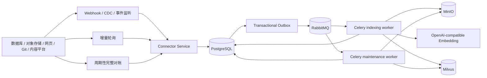
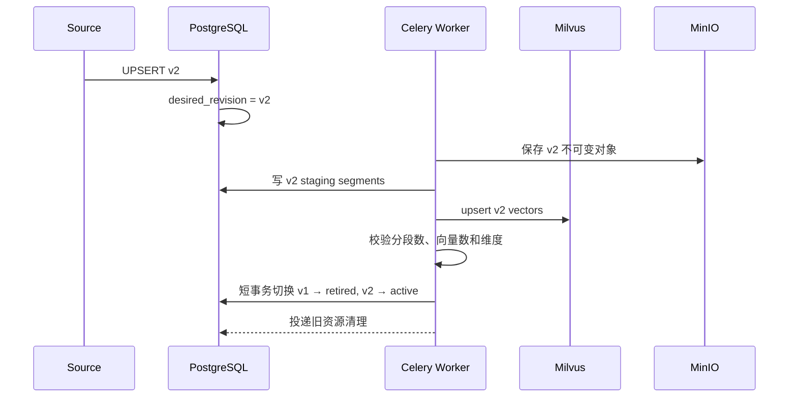

# 通用数据源变更检测与安全增量索引设计

最后更新：2026-08-31

文档状态：方案已确认，待用户复核书面设计后进入实施计划调整

## 1. 背景与范围

现有知识库索引设计覆盖本地文件上传、解析、分段、Embedding、Milvus 写入和索引版本切换。为了支持数据库、对象存储、网页、Git、企业网盘等外部系统，需要一套不依赖具体数据源的变更同步机制。

本设计把不同数据源的新增、修改和删除统一为内部事件：监听负责低延迟，轮询和完整对账保障最终一致性；更新采用不可变 revision 和先构建后切换，禁止先删除旧向量再重建。

本设计是[Dify 风格知识库创建与完整索引设计](./2026-08-31-dify-style-dataset-indexing-design.md)的扩展，不改变 PostgreSQL、MinIO、RabbitMQ/Celery、OpenAI-compatible Embedding 和 Milvus 的既定职责。

目标：

- 通过稳定源标识和 Hash 判断新增、有效修改、重命名和重复事件。
- 支持 Webhook、CDC、事件订阅等低延迟监听。
- 支持增量轮询和周期性完整对账，补偿监听事件丢失。
- 对更新提供无检索空窗的版本化重建，对删除先隐藏再清理。
- 在 RabbitMQ/Celery 至少一次投递下保持端到端幂等。
- 防止乱序任务把较旧版本重新激活。

非目标：

- 不保证任意大小文件都在数秒内完成全部索引。
- 不实现跨 PostgreSQL、MinIO 和 Milvus 的分布式事务。
- 不承诺每种数据源都有监听能力。
- 第一阶段不实现复杂的块级 diff 和向量复用。
- 不使用 Redis 作为 Broker、任务状态库或分布式锁。

## 2. 核心原则

1. PostgreSQL 保存连接器游标、源文档状态、变更事件、revision、任务和当前生效版本，是唯一业务事实来源。
2. 监听负责低延迟，增量轮询和完整对账负责最终一致性；RabbitMQ 不能让低频轮询变成秒级发现。
3. 更新采用 create-before-destroy：新 revision 完整构建并校验后再切换，随后异步删除旧向量。
4. 删除采用 hide-before-delete：先撤销 PostgreSQL 可见性，再异步清理 Milvus 和 MinIO。
5. 接受 Webhook、轮询、RabbitMQ 和 Celery 的重复投递，通过唯一键、条件更新、稳定 ID、Milvus upsert 和幂等清理得到正确最终结果。

## 3. 总体架构



## 4. 数据源抽象

每个逻辑源文档使用以下组合唯一识别：

```text
connector_id + source_document_key
```

`source_document_key` 优先采用提供方稳定 ID，而不是展示名称：

| 数据源 | 推荐标识 |
|---|---|
| MinIO、S3、OSS | provider object ID；无稳定 ID 时使用规范化 object key |
| 数据库 | schema + table + primary key |
| 网页 | canonical URL 或 CMS page ID |
| Git | repository ID + path；有 rename 事件时保留映射 |
| Notion、Confluence | provider page/content ID |
| 本地上传 | Graph-RAG `document_id` |

稳定源 ID 未变化而展示名称变化时只更新元数据，不重新生成向量。

不同数据源 adapter 实现统一协议：

```python
class SourceConnector(Protocol):
    async def poll_changes(self, cursor: str | None) -> ChangeBatch: ...
    async def list_snapshot(self, checkpoint: str | None) -> SourceSnapshot: ...
    async def fetch_metadata(self, source_document_key: str) -> SourceMetadata: ...
    async def open_content(self, source_document_key: str, source_version: str | None): ...
```

监听 adapter 也必须转换成统一 `SourceChange` 并先持久化，不能绕过事件表直接调用索引 Worker。Connector 凭据通过服务端 secret 引用获得，不进入消息、日志或前端响应。

## 5. Hash 与变更判断

数据源 version、ETag、last-modified 和 size 只作为快速指纹；multipart ETag 不一定等于文件 MD5，业务去重使用系统计算的 SHA-256。

保存三类指纹：

```text
source_content_hash = SHA256(canonical source payload)
normalized_text_hash = SHA256(normalized parsed text)
index_config_hash = SHA256(canonical indexing configuration)
effective_index_hash = SHA256(normalized_text_hash + index_config_hash)
```

`index_config_hash` 至少包含 parser 版本、清洗规则、索引技术、分段模式、chunk size、overlap、父子配置、Embedding 模型和维度。

规范化由 connector 决定：数据库记录只序列化参与索引的字段并固定顺序；API JSON 排除抓取时间等动态字段；网页排除广告和运行时装饰信息；文本统一编码和换行。

`normalized_text_hash` 用于审计、诊断 parser 行为和后续等价内容优化。第一阶段不让一个新原始 revision 复用旧 revision 的 segment 关联，以免 active revision 与 segment revision 出现双重语义。

第一阶段判断规则：

| 条件 | 行为 |
|---|---|
| 源 Hash 和配置 Hash 均相同 | no-op，不创建索引任务 |
| 原始内容 Hash 变化，配置兼容 | 单文档版本化重建；即使正文 Hash 相同也保持流程一致 |
| 模型、维度、索引技术或全局分段配置变化 | 全知识库索引版本重建 |

未来只有在性能数据证明收益明显，并为 revision 与共享 segment 建立明确关联模型后，才能增加“正文 Hash 相同则复用旧向量”的优化。

## 6. 数据模型

### 6.1 `source_connectors`

```text
id, dataset_id, connector_type, display_name
secret_ref, sync_mode: listen | poll | hybrid
cursor, checkpoint, poll_interval_seconds
status, last_error
last_event_at, last_polled_at, last_reconciled_at
created_at, updated_at, deleted_at
```

游标只在一个轮询批次完整持久化后推进；批次中途失败时不能越过未处理变化。

### 6.2 `source_documents`

```text
id, connector_id, source_document_key, document_id
display_name, source_version, source_etag
source_content_hash, normalized_text_hash
last_seen_at, missing_since, desired_revision_id
created_at, updated_at, deleted_at
UNIQUE(connector_id, source_document_key)
```

### 6.3 `source_events`

```text
id, connector_id, dataset_id, source_document_key
operation: upsert | delete
source_event_id, idempotency_key
source_version, source_etag, occurred_at
status: pending | published | processing | completed | ignored | failed
attempts, last_error
created_at, published_at, completed_at
```

优先对 provider event ID 建唯一约束。没有事件 ID 时使用：

```text
SHA256(connector_id + source_document_key + source_version + operation)
```

### 6.4 `document_revisions`

`documents` 表示逻辑文档，`document_revisions` 表示不可变内容版本：

```text
id, document_id, source_document_id
source_version, source_content_hash, normalized_text_hash, index_config_hash
object_key, original_filename, content_type, file_size
status: uploaded | indexing | active | failed | superseded | retired | deleted
error, created_by, created_at, activated_at, retired_at, deleted_at
```

`documents` 增加 `active_revision_id`、`desired_revision_id`；`document_segments` 增加 `document_revision_id`、`dataset_index_id`、`content_hash` 和 `source_locator`。

### 6.5 Transactional Outbox

Connector 在同一个 PostgreSQL 事务中写入 `source_events` 和 outbox。Dispatcher 投递 RabbitMQ 后标记 published，定时任务补发超时 pending outbox。这样消除数据库已提交但消息未发出的双写空窗；重复投递由消费端幂等处理。

## 7. 标准事件与变更发现

所有 adapter 只产生 `UPSERT`、`DELETE` 两种操作。`UPSERT` 由消费端判定为新增、更新或 no-op，避免维护两套索引管道。

```json
{
  "event_id": "evt-uuid",
  "connector_id": "connector-001",
  "dataset_id": "dataset-001",
  "source_document_key": "provider-file-123",
  "operation": "UPSERT",
  "source_version": "42",
  "source_etag": "abc123",
  "occurred_at": "2026-08-31T16:30:00+08:00"
}
```

消息只携带引用和小型元数据，不携带文件正文、大段文本、凭据或向量。

支持时优先使用 Webhook、数据库 CDC、MinIO/S3 notification、Git webhook 或第三方事件订阅。监听入口完成签名、重放窗口、大小和幂等校验后立即返回，正文同步必须异步执行。

增量轮询使用 provider cursor、change token 或稳定分页游标；只有批次全部落库后推进游标。同一 connector 通过 PostgreSQL lease 防止轮询重叠。

周期性完整对账比较 provider 权威快照和 `source_documents`，补发漏掉的 UPSERT/DELETE，不绕过统一事件管道。

普通轮询的一次缺失不能直接判定删除。只有权威 DELETE 事件，或者成功、完整的权威快照连续缺失/超过宽限期，才能确认删除：

```text
第一次缺失        → missing_since = now()
连续完整快照缺失  → 确认删除
超过配置宽限期    → 确认删除
期间重新出现      → 清除 missing_since
```

## 8. UPSERT 处理

新增流程：

```text
claim event
  → 获取元数据与不可变内容快照
  → 计算 source_content_hash
  → 创建 documents/source_documents/document_revision
  → MinIO 保存不可变原始内容
  → 解析并计算 normalized_text_hash
  → 写入 staging segments
  → Embedding + Milvus upsert，或生成经济索引关键词
  → 校验
  → 激活 revision 和 segments
```

MinIO object key 必须包含 revision ID，禁止覆盖旧对象：

```text
datasets/{dataset_id}/documents/{document_id}/revisions/{revision_id}/{filename}
```

内容未变化时只更新 `last_seen_at`、source version 和展示元数据，事件标记为 `ignored/content_unchanged`，不调用 Embedding、不写 Milvus。

内容更新时，当前 v1 保持 active，v2 使用 staging 构建：



切换事务执行：

```text
revision-v1: active   → retired
revision-v2: indexing → active
old segments: completed → soft deleted
new segments: staging   → completed
documents.active_revision_id = revision-v2
```

事务提交后，maintenance Worker 幂等删除 v1 的 Milvus 向量，并按保留期清理旧 MinIO 对象。任一步最终失败时不切换，v1 继续提供查询。

## 9. DELETE 处理

确认删除后，在 PostgreSQL 短事务内软删除 document、source document 和 active segments，取消该文档运行中任务并创建 maintenance cleanup 任务。API 和检索从事务提交起不再返回该文档；Milvus 向量、revision 和 MinIO 对象随后异步幂等清理。

数据源以同一稳定 ID 重新出现时，默认恢复原 `document_id` 并创建新 revision，以保留审计关系。

## 10. 并发、乱序与变更合并

- 同一个 `document_id` 同时只允许一个 Worker 获得更新 lease，不同文档可以并行。
- 每次有效 UPSERT 都更新 `documents.desired_revision_id`。
- 激活事务必须验证 `target_revision_id == desired_revision_id`；否则将任务标记为 `superseded`，禁止激活。
- 对频繁保存的数据源可配置 2～5 秒 debounce，窗口内只索引最新版本。
- provider 有单调 version 时拒绝激活较低版本；否则以系统接收序列和 desired revision 为准。
- DELETE 和后续 UPSERT 按同一源文档序列处理，最终以最新期望状态为准。

## 11. RabbitMQ 与 Celery

| 队列 | 职责 |
|---|---|
| `source-events` | 拉取最新源状态、Hash 判断和事件归并 |
| `indexing` | 下载、解析、切分、Embedding、关键词和 Milvus 写入 |
| `maintenance` | 对账、恢复、旧资源清理和失败补偿 |

任务业务状态全部写 PostgreSQL，不依赖 Celery result backend。Worker 使用 `acks_late`、有限 prefetch、条件 claim、lease、heartbeat 和显式重试分类。

网络超时、429、502、503、504 和依赖短暂不可用可以重试；文件损坏、无正文、401/403、模型不存在、维度不一致和非法 connector 配置快速失败。建议退避 30 秒、2 分钟、10 分钟；最终失败时保留旧 active revision。

## 12. 查询一致性

Milvus 中可能暂时同时存在 active、staging 和 retired revision 的向量。检索必须回查 PostgreSQL，只接受：

```text
documents.deleted_at IS NULL
document_segments.deleted_at IS NULL
document_segments.status = completed
document_segments.document_revision_id = documents.active_revision_id
dataset_indexes.status = active
```

Milvus 适度 over-fetch 后再经过 PostgreSQL 过滤，例如请求 Top 10 时先获取 Top 30；倍率根据过滤率监控调优。旧向量仍需及时清理，over-fetch 不是永久保留历史向量的替代方案。经济索引也使用同一 active revision 条件。

## 13. 配置变化与重建范围

| 变化 | 范围 |
|---|---|
| 文件名或展示元数据 | 只更新元数据 |
| 单文档正文 | 单文档安全重建 |
| 单文档局部规则且不改变全局语义 | 单文档安全重建 |
| Embedding 模型或维度 | 全知识库新索引版本和新 collection |
| 高质量与经济互换 | 全知识库重建 |
| 普通与父子分段互换 | 全知识库重建 |
| 全局 chunk、overlap、清洗或 parser 规则 | 全知识库重建 |
| Milvus metric/schema | 全知识库新 collection |

全知识库重建继续遵循 `dataset_indexes` building → active 切换，不得逐文档混用不兼容配置。

## 14. API 边界

```text
POST   /api/knowledge_base/{dataset_id}/connectors
GET    /api/knowledge_base/{dataset_id}/connectors
GET    /api/knowledge_base/{dataset_id}/connectors/{connector_id}
PATCH  /api/knowledge_base/{dataset_id}/connectors/{connector_id}
DELETE /api/knowledge_base/{dataset_id}/connectors/{connector_id}

POST   /api/knowledge_base/{dataset_id}/connectors/{connector_id}/sync
POST   /api/knowledge_base/{dataset_id}/connectors/{connector_id}/reconcile
GET    /api/knowledge_base/{dataset_id}/connectors/{connector_id}/events

GET    /api/knowledge_base/{dataset_id}/documents/{document_id}/revisions
GET    /api/knowledge_base/{dataset_id}/documents/{document_id}/revisions/{revision_id}
POST   /api/knowledge_base/{dataset_id}/documents/{document_id}/revisions/{revision_id}/retry

POST   /api/source-webhooks/{connector_id}
```

Connector 创建、手工同步和对账接口返回持久化状态或 `202 Accepted + job_id`，不等待首次导入或索引完成。

## 15. 可观测性与 SLO

记录 connector 最近监听、轮询、对账时间和游标，以及事件量、重复率、ignored 率、失败率、发现延迟、排队延迟、处理延迟、superseded 数、清理积压和 Milvus 候选过滤率。

健康监听链路的本期 SLO：

```text
有效变更发生 → indexing 任务进入 processing：P95 < 5 秒
```

这不等于大型文件在 5 秒内完成索引；轮询数据源的发现延迟由轮询间隔决定。

## 16. 安全

- Webhook 校验签名、时间窗口和重放 ID。
- Connector 凭据使用 secret reference 或加密存储，API 只返回脱敏信息。
- 数据源访问遵循最小权限。
- 下载限制大小、超时、重定向、内网地址和内容类型，防止 SSRF 与资源耗尽。
- source key 和文件名不能直接拼接成本地路径或未转义查询表达式。
- 日志不记录正文、API Key、数据库密码或完整 Webhook payload。
- 数据集权限检查覆盖 connector、event、revision 和 retry API。

## 17. 测试与验收

单元和集成测试覆盖：

- source key 规范化和三类 Hash 稳定性。
- 相同内容 no-op、元数据变化不重建。
- UPSERT/DELETE 幂等和 cursor 安全推进。
- 非权威单次缺失不触发删除。
- Outbox 首次投递失败后补发。
- RabbitMQ 重复投递不产生重复 revision、segment 或向量。
- Worker 崩溃后的 lease 恢复。
- 新 revision 失败时旧 revision 继续可检索。
- 切换后旧向量未清理时 PostgreSQL 过滤结果正确。
- DELETE 逻辑生效后立即不可检索，外部资源随后清理。
- v2、v3 乱序完成时只有 desired v3 可以激活。
- 完整对账能补发监听遗漏事件。

端到端完成条件：

1. 新增源文档能够自动创建文档并完成索引。
2. 相同内容重复事件不调用 Embedding。
3. 只修改文件名不重新索引。
4. 修改正文时旧内容在切换前持续可检索，新内容成功后一次生效。
5. 新内容索引失败时旧内容不受影响。
6. 删除后不返回旧内容，即使 Milvus 清理暂时失败。
7. 健康监听链路满足任务启动 P95 指标。
8. 停止监听后，完整对账能够发现并补偿变化。
9. 重复、乱序和重试消息不会让旧 revision 覆盖新 revision。
10. 模型、维度或全局分段配置变化会升级为全知识库重建。

## 18. 分阶段实施

1. **版本化安全更新**：建立 revision、active/desired 指针和分段 revision 关联，先为手工上传实现 Hash 去重、安全切换和清理。
2. **连接器控制面和轮询**：建立 connector、source document、event 和 outbox，实现一个轮询 connector、完整对账和删除宽限期。
3. **监听与秒级触发**：为选定数据源实现 Webhook/CDC，完成签名、乱序、debounce 和延迟指标。
4. **性能优化**：根据指标调整 Worker/Embedding/Milvus batch；只有成本数据证明必要时再设计块级 diff。

## 19. 已确认的架构决策

| 决策 | 原因 |
|---|---|
| 稳定源 ID + Hash | 区分重命名、内容修改和重复事件 |
| 监听 + 轮询 + 完整对账 | 同时获得低延迟和最终一致性 |
| UPSERT/DELETE 统一事件 | 降低 connector 与索引管道耦合 |
| PostgreSQL outbox | 消除数据库提交与 RabbitMQ 投递之间的双写空窗 |
| 不先删除旧向量 | 更新失败时旧知识仍可查询 |
| 不可变 document revision | 支持审计、重试、切换和延迟清理 |
| active/desired 双指针 | 防止乱序任务把旧版本重新激活 |
| PostgreSQL 决定检索可见性 | 跨存储无共享事务时保持正确结果 |
| 至少一次投递 + 幂等 | 适配真实消息语义和故障恢复 |
| 第一阶段文档级重建 | 优先保证正确性，避免过早引入块级 diff |
